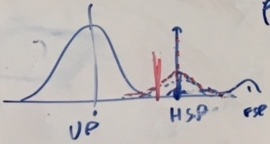

# Notational notes

- The words "fish" and "animal" (and probably, later, "tuna") are used interchangably.
- CKMR is close-kin mark-recapture.

# Dave doesn't know genetics

Some definitions because I don't know about genetics

- **locus**/**loci**: contiguous set of `G`s, `A`s, `T`s, `C`s, in a given location along the chromosome. *Think*: regular expression; need to match a pre/post-amble thing and the bit in the middle has some variation (at just one position?). The trivially largest loci is the whole genome. The smallest one is a bit more tricky.
- **allele**: a varying (at the population level) locus. There may be multiple alleles in the population but each individual will carry at most 2 of them.
- **Mendelian exclusion**: are a given parent-offspring pair compatible at all to be matched, some are not (e.g., `AA`-`AB`, yes because you can get the `A` from either parent but `BB`-`AA`, no since you only have `B`s, so where could you get the A from?).
- **linkage**: issue that there is some correlation along the genome between alleles, so if they are physically close, you are more likely to inherit them.
- **ALF** (or better, **AlF**): ALlele Frequency.
- **SPA**: (not genetics, but will come up) saddle point approximation.
- **elf**: elves do the actual lab biology that gets us from the samples to a CSV file. Elves may or may not be real.

# Doing CKMR

There are three stages to CKMR:

1. *genotyping*: actually getting the biological samples and coding them into something that the computer can read. This is done by "elves" according to MVB -- some biological thing that takes the samples, cuts up the DNA and gets interesting sections (alleles/loci/SNPs).
2. *kin pair finding*: working out whether a given pair of animals are related by looking at whether there are matches in alleles. "Kin" can refer to a number of different relationships, only some of which are "interesting".
3. *close-kin mark-recapture*: actually doing the CKMR, thinking about population dynamics etc.

# But what *are* "genotypes"?

6 possible genotypes per individual per locus: `AA`, `AB`, `BB`, `OO`, `AO`, `BO`. These vary between the pairs ("copies"). Here `A` and `B` represent whole loci (e.g., "`GCCCTACCTA`") and `O` represents `NULL`, where the code could not be read.

# What about doing the pair finding?

There are (at least) 4 different pairings that are interesting and some others that are not:

- *duplicates* (DUP): if there was some problem with the samples at stage 1 above or if the same individual gets sampled more than once.
- *parent-offspring* (POP): what you'd expect.
- *full-sibling* (FSP): relatively unlikely, depending on the population size and mating strategy.
- *half-siblings* (HSP): if you have 1 parent in common.
- *cousins*: different demographics, probably want to exclude?
- *unrelated pairs* (UP): animals that are not related, don't want to do anything with them, but do want to know who they are!

## Data

Before talking about kin finding, how is the data formatted? At different stages, the data are formatted differently, roughly speaking:

1. Fresh from the sequencer we have a matrix with columns as the fish and rows as the alleles (for a given loci there might be many alleles). Entries are the frequency (number of "reads") of the allele in the given fish.
2. Process to get presence absence of the alleles (`A`, `B` or `O`). This is a bit complicated and involves processing multiple alleles down to the most useful two (plus `O`).
3. Estimate the population levels of each allele.
4. Format to fish as rows and columns as loci. Entries are then then the genotype of that loci for that fish (e.g, `AB`).

## Getting kin pairs

Basic idea here is calculate a statistic between a pair of fish to evaluate the relationship (more on that below), then plot a histogram of the pair scores across the samples. Humps/separations in the histogram show particular relationships. This will get more obvious below.

These techniques rely on allele frequencies (ALFs) from the *sample* -- there are obvious potential issues there. To account for "ALF error" we can resample the ALFs, recompute SPAs and repeat (say 100 times). (This will give us a bunch of different histograms.) (Probably not necessary for DUPs and FSPs as these should "jump out".)

We remove the pairings *in order*.

### Duplicates

To find duplicates we calculate the number of loci that are the same in a fishpair -- actually number of exclusions. The number of exclusions for a fish with itself is 0, but there is some error in this. In any case the duplicates pile themselves up near zero, the rest are in a big lump further down the horizontal axis (this includes all the other relationships).

### Full sibling pairs

Not many of these... Easier to do this post-HSP finding as they will distribute themselves "after" the HSPs:

So we use the PLOD statistic, as defined below for HSPs...

### Parent-offspring pairs

POPs are found using *weighted pseudo-exclusions*, WPSEX. We can re-group the genotypes to have, e.g., `AO` and `AA` be in the same group `AAO` if we're not sure. In that case there are some pseudo-exclusions to think about. If we had `AAO` and `BBO` then `AO`-`BB`, `AA`-`BO` and `AA`-`BB` are not allowed (for PO or OP relations) but we don't know what these are (e.g., if `O` are rare), so we don't exclude `AAO` `BBO` in that case (hence "pseudo").

### Half-siblings

HSPs require a different metric again, pseudo-log-odds: PLODs. We calculate this with something like:
$$
\text{LOD}_\text{HSP, UP} = \log \frac{\mathbb{P}\left[\tilde{g}_1, \tilde{g}_2 \vert \text{HSP} \right]}{\mathbb{P}\left[\tilde{g}_1, \tilde{g}_2 \vert \text{UP}\right]}
$$
for genotypes $g_1$, $g_2$, recorded as $\tilde{g}_1$, $\tilde{g}_2$ (strictly speaking there should be a subscript $l$ on these for the given loci, but that's dropped for notation simplicity). We can write the above about any kin relationship combination, here we separate HSP from UP though. The pseudo comes from suming over the loci, giving us a score for an pairing.

Can calculate $\mathbb{P}\left[\tilde{g}_1, \tilde{g}_2 \vert \text{HSP} \right]$ as:
$$
\mathbb{P}\left[\tilde{g}_1, \tilde{g}_2 \big\vert \text{HSP} \right] = \sum_{g_1, g_2} \left\{ \mathbb{P}\left[\tilde{g}_1 \big\vert g_1 \right] \mathbb{P}\left[\tilde{g}_2 \big\vert g_2 \right] \mathbb{P}\left[\tilde{g}_1, \tilde{g}_2 \big\vert \text{HSP} \right]\right\}
$$
where "HSP" could be whatever kinship relationship we are interested in (thinking more generally here), we can call this $k_{12}$, say. In that case we can calculate:
$$
\mathbb{P}\left[\tilde{g}_1, \tilde{g}_2 \big\vert \text{HSP} \right] = \kappa_0  \mathbb{P}\left[g_1 \right] \mathbb{P}\left[g_2 \right] + \kappa_1 \mathbb{P}\left[g_1, g_2 \big\vert \text{1 allele shared} \right] + \kappa_2 \mathbb{P}\left[g_1 \right] \mathbb{I}\left[g_1 = g_2 \right]
$$
Thinking simply about the above equation, we're looking at the probabilities that 0, 1 and 2 alleles are shared. Also worth thinking here that *all* inheritence is from parent-offspring pairs (somewhere down the line; this seems obvious but wasn't immediately to me, esp. given equation 5.1 of Bravington, Skaug and Anderson, 2016). These are identical by descent (*idb*) In the above:
$$
\kappa_m = \mathbb{P} \left[ m \text{ shared alleles} \big\vert k_{ij} \right]
$$
where appropriate values can be found in Table 1 of Bravington, Skaug and Anderson, 2016; and:
$$
\mathbb{P}\left[g_i \right]  = \pi(g_{i,a}) \pi(g_{i,b}) \left(1 + \mathbb{I}\left[g_{i,a} \neq g_{i,b} \right] \right)
$$
where $\pi(g_{i,a})$ is the population frequency of $g_{i,a}$ (the above expression assumes "Hardy-Weinberg equilibrium without linkage disequilibrium".

With all of that calculated the PLOD is then:
$$
\text{PLOD}_\text{HSP, UP} = \sum_l \log \frac{\mathbb{P}\left[\tilde{g}_{l,1}, \tilde{g}_{l,2} \vert \text{HSP} \right]}{\mathbb{P}\left[\tilde{g}_{l,1}, \tilde{g}_{l,2} \vert \text{UP}\right]}
$$
where the summation is over loci, indexed by $l$.

In practice, there can be "interference" from half cousins (HCPs) and "half-thiatic pairs" (HTPs; that is when the mother of one is grandmother of another).

We want to minimize false positives in this process, so we position out threshold pretty conservatively (to ensure we only have the HSPs that are definitely right). We know that (post-removing the FSPs) we will have all the HSPs right to the right of the mean of the distribution, we can then use a Normality/symmetry argument to get back to the HSPs we discarded because of our conservative cutoff.

## Model/data checking

These checks use allele frequencies ALFs... Note that the allele frequencies used for this are from the *sample* (obvs?) so that might cause some problems if the sample isn't big/representative enough.

### `hetzminoo` (heterozygotes minus `OO`)

This test looks at whether the allele frequencies in a given fish seem right, or if there are discrepancies due to ($i$) degraded DNA or ($ii$) sample contamination.

First define the following indicator for a loci $l$:
$$
\begin{split}
\mathbb{I}[l] = -1 \quad & \text{if } l= \texttt{OO}\\
                0  \quad & \text{if } l= \texttt{AAO}\text{ or }\texttt{BBO}\\
                1  \quad & \text{if } l= \texttt{AB}.
\end{split}
$$
Then for a given fish, we calculate:
$$
\text{hetzminoo}_\text{fish} = \sum_l \mathbb{I}[a_l],
$$
where a more negative result (more `OO`s) indicates degraded sample DNA (hard for the genetics elves to tell what the sample is) and more positive results (more `AB`s) indicates sample contamination.

We can also calculate a weighted version of this statistic (which we might need):
$$
\text{weighted hetzminoo}_\text{fish} = \sum_l w_l \mathbb{I}[a_l],
$$
where we can have "optimized" for $w_l$ for either: ($i$) finding contamination or ($ii$) finding degraded DNA.

If both degradation *and* contamination has happened, maybe everything is terrible and you shouldn't do close-kin?

### Predicting HSP utility

Should you try for HSPs? Is it worth it? We can find this out by doing some approximations to the bumps in the histograms. We can use that to see if we can set a threshold that separates HSPs from UPs/HTP/HCP/etc (henceforth, "junk"). This uses an SPA to the distribution of the "junk" (in MVBspeak "the null distribution").

### Do we need 4 or 6 alleles?

We can do some testing (similar to what is used above) to test if we need to go to 6 alleles rather than 4. This might make the elf-intensive activities cheaper(?)

# References

Bravington, M.V., Skaug, H.J. and Anderson, E.C. (2016) Close-Kin Mark-Recapture. Statistical Science.

